# **Blackjack**
## **Site Overview**
Blackjack is a classic game dating back to around the 1700s. My first introduction to it was as pontoon (a common name for blackjack in the UK). My mum and I would spend hours playing short rounds for fun while traveling or simply sitting around watching TV. 

My current line of work is in the online casino industry. Hence, I wanted to create something relevant to my daily life. As it was for my mother and me, this game intends to be a bit of harmless fun for those who enjoy this traditional game. Used to pass the time by strategically drawing cards, thinking quickly, and trying to beat the opposition (in this case, a computer).

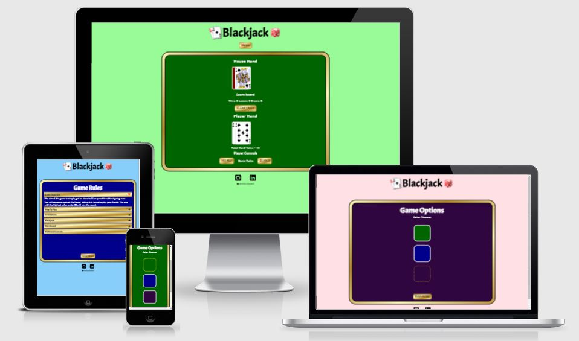

## Table of contents:
* [**Blackjack**](#blackjack)
  * [**Site Overview**](#site-overview)
  * [**Planning Stage**](#planning-stage)
    * [**Target Audience:**](#target-audience)
    * [**User Stories:**](#user-stories)
    * [**Site Aims:**](#site-aims)
    * [**How Will This Be Achieved:**](#how-will-this-be-achieved)
    * [**Wireframes:**](#wireframes)
    * [**Color Scheme:**](#color-scheme)
    * [**Typography**](#typography)
* [**Current Features**](#current-features)
  * [***Header Element***](#header-element)
    * [***Title:***](#title)
    * [***Main Menu button (navigation tag):***](#main-menu-button-navigation-tag)
* [**Main Window:**](#main-window)
  * [**Main Menu (navigation tag):**](#main-menu-navigation-tag)
  * [**Sub Menus**](#sub-menus)
    * [***Game Rules***](#game-rules)
    * [***Options:***](#options)
      * [**Green (default) Theme**](#green-default-theme)
      * [**Blue Theme**](#blue-theme)
      * [**Purple Theme**](#purple-theme)
    * [***Responsible Gaming:***](#responsible-gaming)
    * [***Back to Main menu Button (navigation tag)***](#back-to-main-menu-button-navigation-tag)
  * [**Card Table**](#card-table)
    * [**Dealer Side of the Table:**](#dealer-side-of-the-table)
      * [***House Hand:***](#house-hand)
      * [***Scoreboard:***](#scoreboard)
    * [**Player Side of the Table**](#player-side-of-the-table)
      * [***Player Hand:***](#player-hand)
      * [***Player Controls***](#player-controls)
    * [**Game Table Pop up Modal**](#game-table-pop-up-modal)
    * [**Game Initiation Modal:**](#game-initiation-modal)
    * [**Results Modals:**](#results-modals)
      * [***Win:***](#win)
      * [***Lose:***](#lose)
      * [***Draw:***](#draw)
      * [***Player Bust:***](#player-bust)
      * [***House Bust:***](#house-bust)
      * [***House Blackjack:***](#house-blackjack)
      * [***Player Blackjack:***](#player-blackjack)
    * [**Card Positioning**](#card-positioning)
* [**Footer**](#footer)
  * [**Future-Enhancements**](#future-enhancements)
  * [**Testing Phase**](#testing-phase)
  * [**Deployment**](#deployment)
  * [**Credits**](#credits)
    * [**Honorable mentions:**](#honorable-mentions)
    * [**General reference:**](#general-reference)
    * [**Content:**](#content)
    * [**Media:**](#media)

## **Planning Stage**

### **Target Audience:**
  * Adults who enjoy playing blackjack for the strategy but do not want to spend money playing.
  * Fans of the classic card game blackjack.
  * People are looking for an enjoyable way to spend some time away from a more concentrated task.
  * Visually impaired people who still want to join in the fun of playing blackjack for free online.

### **User Stories:**
As a user, I want to: -
  * Be able to play blackjack for free without the need to break the bank if I lose.
  * Be able to navigate around the game controls and menu with as few clicks as possible.
  * Use keyboard shortcuts instead of the mouse.
  * Track the progress of each round in some way.
  * Find a clear explanation of the game rules and how to play.
  * Adjust the color settings of the game table and surrounding area.

### **Site Aims:**
1. To provide a free version of blackjack that anyone can enjoy.

1. Be fully accessible to the visually impaired.

1. Ensure the site is easy to navigate.

1. Provide simple to understand instructions.

1. To enable the user to use the keyboard as much as possible should they choose to.

1. Provide a record of all wins, loses, and draws.

1. Provide feedback to the user after each round.

1. To be an enjoyable distraction to fill the user's time.
   
### **How Will This Be Achieved:**
1. The game will be free to use, and no sign up required.

1. Ensuring the use of semantic elements, alternate text, and aria labels where appropriate.

1. The landing page will be the main menu. Access to the main menu can also be done throughout the game using the menu button or pressing m on the keyboard. This menu will contain links to:
    * Game rules.
    * Game options menu. 
    * Card table.
    * Responsible Gaming Statement.

1. The relevant game rules are divided into clearly marked sections of the rules sub-menu. 

1. By indicating keyboard shortcuts on each control button.
 
1. After each round, the relevant tally will be increased by one.

1. Upon the conclusion of each round, a modal will appear on the screen with the result.

1. Providing a simple, appealing, and accessible interface.
   
### **Wireframes:**

To give my project structure and work out the best-intended flow of information, I created the below wireframes as a guide.
    
* Mobile Wireframes:
    * [Game Table and Main Menu.](docs/wireframes/mobile-gameboard-menu.png)

* Desktop Wireframes:  
    * [Desktop Game Table](docs/wireframes/desktop-gameboard.png)
    * [Desktop Main Menu](docs/wireframes/desktop-menu.png)

Along the way, the design and menu options have changed slightly to improve the app's user experience. The changes included: -

  * User controls and scoreboard switched positions to make the game control more accessible for the user.
  * The removal of the contact form option in the menu. This feature was not necessary since I decided to add the social links in the footer.
  * All game elements moved within the app's central area. The only exceptions to the were: 
      * Social media links to GitHub and linked in.
      * The title and surrounding images.
      * Menu button visible from the game table but hidden when within the menu itself.

Since this for this project, wireframes are not required and were used only to structure my creative process, I did not feel the need to pre-design each of the sub-menus in turn. For this reason, I have omitted them. 

### **Color Scheme:**
When deciding the app's color scheme, I first began with the classic green table then worked outwards from there. I wanted the app to feel regal like a casino while keeping my contrast scores as high as possible for accessibility purposes.
 
I have created the below color grid using [https://contrast-grid.eightshapes.com](https://contrast-grid.eightshapes.com/?version=1.1.0&background-colors=&foreground-colors=FFF%0D%0A000%0D%0ABF953F%0D%0AFCF6BA%0D%0AB38728%0D%0AFBF5B7%0D%0AD3D3D3%0D%0A8B0000%0D%0AFF0000%0D%0AFFD700%0D%0A00008B%0D%0A4682B4%0D%0A00BFFF%0D%0A312B50%0D%0AEE82EE%0D%0A300640%0D%0A008080%0D%0A00FFBF%0D%0A006400%0D%0A&es-color-form__tile-size=compact&es-color-form__show-contrast=aaa&es-color-form__show-contrast=aa&es-color-form__show-contrast=aa18&es-color-form__show-contrast=dnp)

# **Typography**
I imported all fonts using the google fonts.    
  * The primary font used throughout was Acme. I chose this font because it was bold and had a strong presence for the title, headings, and buttons.    
  * For the text of the sub-menus content and the card table, Open Sans was used. My reasoning behind this was that Acme looked unclear when writing a text block in smaller font sizes. 

# **Current Features**
##  ***Header Element***
The header element contains the following: -

### ***Title:***

  * The title serves to make it clear to the user what the game will be from the first instance. 
  * I did not include an anchor tag here for this project since the app is only a single page of HTML.

### ***Main Menu button (navigation tag):***
  * When the card table is visible, it allows the user to navigate back to the menu.
  * This navigation button displays only when the card table is visible.
  * When the main menu is already visible, the button is set to display: none. 
 

# **Main Window:**
## **Main Menu (navigation tag):**
Acts as a landing page for the user. Allowing them: -
  * To proceed directly to the card table.
  * Quick access to the game rules.
  * Access to the options menu.
  * Providing them the industry requirement of a responsible gaming statement.
  

## **Sub Menus**
### ***Game Rules***
I decided to use an accordion menu for this sub-menu to separate and display the different game rules. The reasons for and features of this are as follows: -
  * Prevents the user getting lost in large reams of text. 
  * With only one section being open at a time, this made sure that on smaller screen sizes, the game rules did not spill over the edge of the main window.
  * The accordion buttons show spades pointing up when closed and hearts pointing down when open.
  * Fully accessible with the relevant Aria tags and role assigned and toggled as the user interacts with the relevant sections.

### ***Options:***
On this sub-menu, the player can change the color theme to one of three choices. The first two are standard colors for a casino card table with a surround to suit it. The third was a tribute to pink October and breast cancer awareness. To make the table pink would have ruined the UX of the app, so I added a dark purple color for the table and gave it a pink color for the document body.

 * Each Theme has a complimentary surround color for the body.
 * All three blank buttons have Aria labels to make them accessible to the visually impaired.
 * Active class toggled with the JS file to ensure only the active theme shows as active in the following ways: -
   * Non-active theme buttons have a white border to make them stand out.
   * The active theme and hover have a dotted yellow border to clarify which theme has the active class. 

#### **Green (default) Theme**

#### **Blue Theme**

#### **Purple Theme**

### ***Responsible Gaming:***
Working within the iGaming industry, I recognize the importance of this statement on any gambling-related game. Although there is no money involved in my version of the game at present, the thrill of the chase can still be present. One of the most common feedbacks from every tester who tried it for me was how addictive the game was. I included this to warn those who feel they have a problem and encourage them to seek professional help.

### ***Back to Main menu Button (navigation tag)***
Each sub-menu has a "Main Menu" button at the bottom of the page to navigate back to the root menu.

## **Card Table**

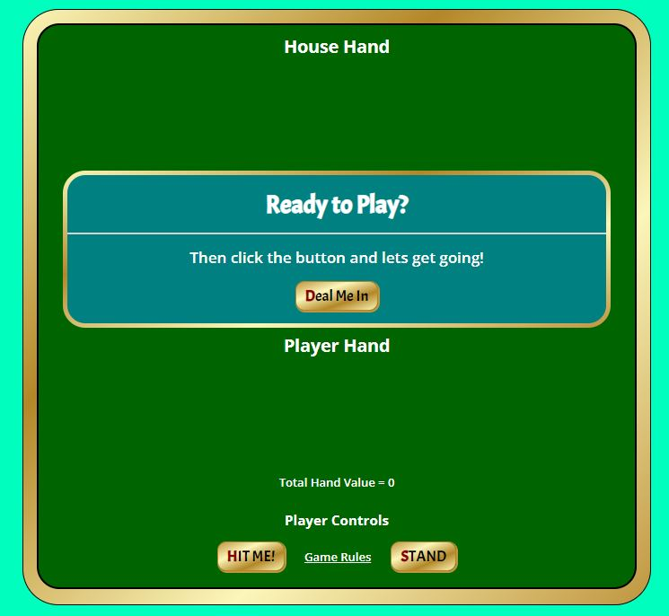

The card table consists of multiple elements and provides a space for the game logic to take inputs from the user display its feedback.

### **Dealer Side of the Table:**
#### ***House Hand:***
  * The first card is dealt for the house and hidden (to be revealed later), only to be replaced with a card image face down on the table.  
  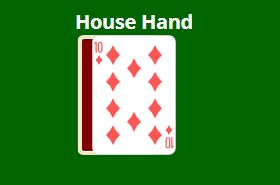
  * When the computer turn is triggered, it reveals the first card and hides the image of the facedown card.  
  

#### ***Scoreboard:***
  * The scoreboard keeps a tally of all wins, losses, and draws. 
  * The user can reset the tally at any time with the "Clear Tally" button.
  * It gives the user something to gauge their progress without a pot of fun money (See future developments.).   
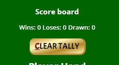

### **Player Side of the Table**
The player side of the table consists of two sections: -
  * Player hand.    
  * Player controls.

#### ***Player Hand:***
Underneath the player's hand, there is a running total to help the user make quick decisions based on the total hand value of their current hand.  
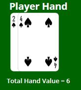

#### ***Player Controls***
The player control section comprises of three controls: -
  * Hit Me Button - Draws a random card from the deck and adds it to the player's hand.
  * Stand Button - End the player's turn and initiate the computer's turn.
  * Game rules anchor tag - Takes the user directly to the game rules.

## **Game Initiation/Results Modal**
### **Game Initiation Modal:**
I included this to allow for all actions first to be initiated by the user. The user is greeted with the below modal when first accessing the card table:  
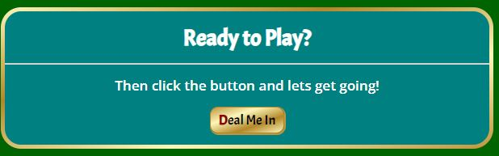

### **Results Modals:**
Results get displayed after each round in a modal with a summary of the outcome. 
#### ***Win:***
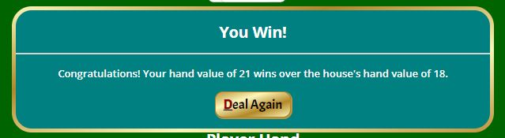

#### ***Lose:***
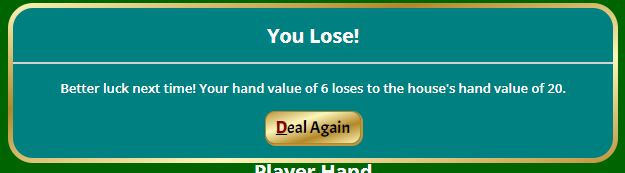

#### ***Draw:***
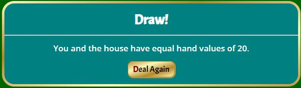

#### ***Player Bust:***
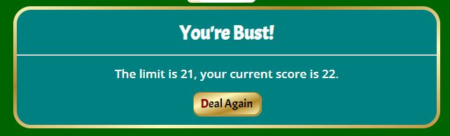

#### ***House Bust:***
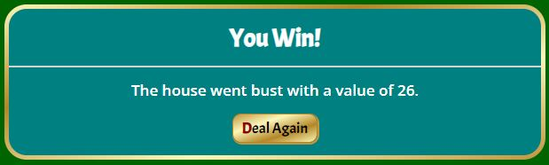

#### ***House Blackjack:***
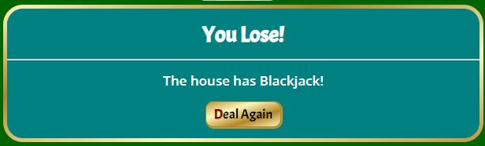

#### ***Player Blackjack:***
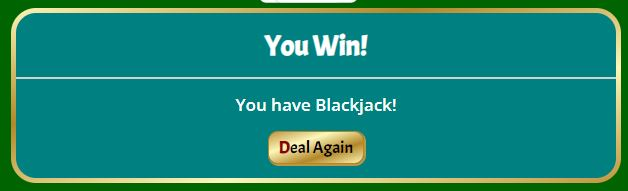

### **Card Positioning**
Each card is placed on top of the other, spaced 15px from the left edge to the left edge. Fanning the cards allow the suit and value to be visible while minimizing the required space for the hand. It also looks neater and simulates how a casino croupier would deal a hand.  
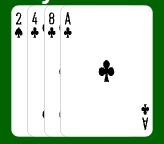

### **Deck of cards:**
My game uses an infinite deck. An infinite deck means there is no limit to the number of times either player can draw a card of the same suit and value from the deck. In other words, duplicate cards are possible.

# **Footer**
  * Includes links to connect to my GitHub and LinkedIn accounts. Purposely kept to the more professional social platforms for the portfolio project.  
    
  * Includes copyright/created by statement.  
    

## **Future-Enhancements**
This game became a bit of a passion project, but due to the steep learning curve involved with learning Javascript in a short amount of time and the fast-approaching deadline, I deemed the below to be above and beyond the required MVP needed to release the game into the public domain initially: -

  * Game sounds - shuffle noise on clicking the re-deal button, when each card dealt a single card noise and lobby sounds/music. The sounds could be toggled on or off via the options page.
  * Card animation - Each card dealt would slide into position as if being dealt from a deck. Card animation would also allow the user to see each card dealt, thus adding to the user's enjoyment.
  * Neon color theme, which changes even the button color and the gold surround.
  * Create a deck as an array of objects to include the card image, value, and card description (suit and value). Creating a whole deck in this way would also allow me to control the number of decks in the stack rather than having an infinite deck. 
  * Give the player a choice over ace high or low.
  * Auto timeout on the results modal could be introduced. The timeout would save the user having to click re-deal every time, and they could wait for the specified period for the pop-up to close by itself.
  * Fun money - the ability to wager and chosen stake amount, potentially replacing the scoreboard as a way of the user gauging their progress.

***

## **Testing Phase**
I have included details of testing both during development and post development in a separate document called [TESTING.md](TESTING.md).

***

## **Deployment**
I deployed the page on GitHub pages via the following procedure: -

1. From the project's [repository](https://github.com/dnlbowers/blackjack), go to the **Settings** tab.
1. From the left-hand menu, select the **Pages** tab.
1. Under the **Source** section, select the **Main** branch from the drop-down menu and click **Save**.
1. A message will be displayed to indicate a successful deployment to GitHub pages and provide the live link.

You  can find the live site via the following URL - [Live Blackjack game](https://dnlbowers.github.io/blackjack)
***

## **Credits**
### **Honorable mentions:**

The project broke me many times over. Without the support of the following people, I would not have made it through. The below list is in no specific order.

* [Richard Wells](https://github.com/D0nni387) - Code Institute Mentor who gave me faith in myself throughout and calmed me down in moments of panic. He saw I was struggling and took the time to help me work through the logic. 

* [Mark Cutajar](https://github.com/markcutajar) Mark - Helped me calm down enough to plan my basic flow. Mark is a man who has repeatedly helped my family and me in more ways than I could ever describe. I am proud to have him as a brother-in-law. 
  

* Mr_Bim_alumni (No GitHub provided) - Explained event listeners to me in a context I understood and gave me hope when it was lost. He was also constantly willing to lend an ear and help me beat out any issue without taking over. Bim's teaching style is skillful and caring. I could not have managed to get through this project without him seeing my distress and keeping an eye on me from thereon. He even pressured me into avoiding my avoidance, and I am so glad he did.

* [Simen Daehlin](https://github.com/Eventyret) - Simen has repeatedly stepped in to guide me along the way, and I am lucky to have such a skilled alumni on my side. 

* [Matt Bodden](https://github.com/MattBCoding) - A true friend and confidant. Matt is always close to the keyboard if I need him. His webinar on CSS positioning gave me the aha moment I needed to work out how to fan the playing cards. Since I first met Matt in a random slack call, I knew he was someone I could easily relate to. 
  
* [Daisy Mc Girr](https://github.com/Daisy-McG) - Within seconds of my posting the question about the W3C assessability guidelines for accordion menus, she jumped into a call with me and helped me rubber duck it out. She is truly a superwoman with a keyboard, and I am lucky to have had her be so willing to assist me. 

* [Niki Tester](https://github.com/Niki-Tester) - Nik was a shock to me; I posted a random question and went to bed. In the morning, I woke up to a notification and Nik's solution. Nik was on his first day of the course, and he spent over an hour debugging my code while I slept. This man is one to watch going forward.

* [Dave Horrocks](https://github.com/daveyjh) - Took the time to break down several topics for me and provide examples. Dave pops out form nowhere when I least expect him, and I am eternally grateful for his explanations and code pens.

### **General reference:**
* The project was influenced by the Code Institutes code along project called Love maths. While I have tried to deviate as much as possible, the code may have some similarities.
* I relied upon W3schools, MDN web docs, and stack overflow for general references throughout the project.
* Accordion menu tutorials - https://www.w3schools.com/howto/howto_js_accordion.asp / https://stackoverflow.com/questions/37745154/only-open-one-accordion-tab-at-one-time

### **Content:**
* All content was written by myself.
* Icons in the footer were taken from [Font Awesome](https://fontawesome.com)
* The golden gradient colour scheme - [brandgradients.com](http://www.brandgradients.com/gold-gradient).
* All fonts imported from - [Google Fonts](https://fonts.google.com/)
* Accessibility checker - [WAVE - Web accessibility evaluation tool](https://wave.webaim.org/)
  
### **Media:**
* All card front card images taken from https://commons.wikimedia.org/wiki/Category:SVG_English_pattern_playing_cards
* Back of cards taken from - https://commons.wikimedia.org/w/index.php?search=playing+cards+back+svg&title=Special:MediaSearch&go=Go&type=image
* Logo-start/favicon taken from https://www.pngegg.com/en/png-oveak
* Logo-end https://www.pngegg.com/en/png-bhuxt
* Image editor https://pinetools.com/rotate-image
