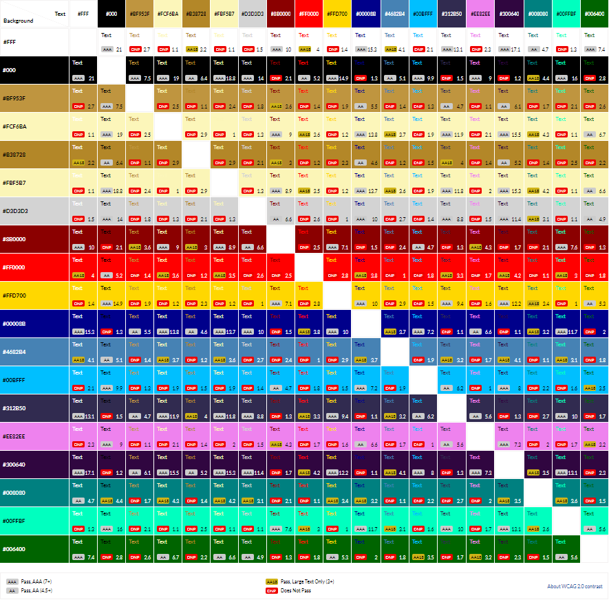
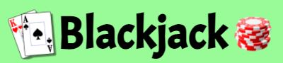
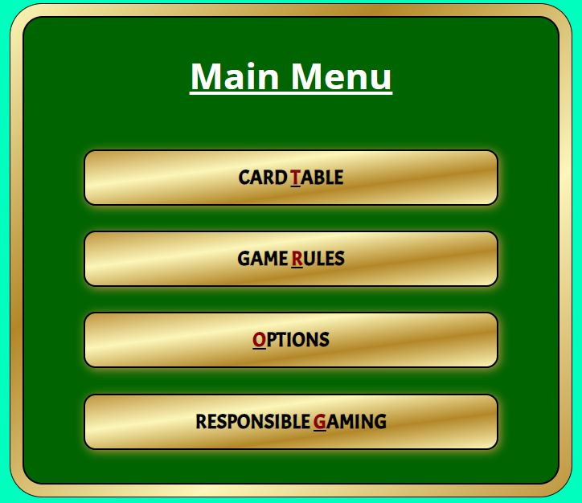
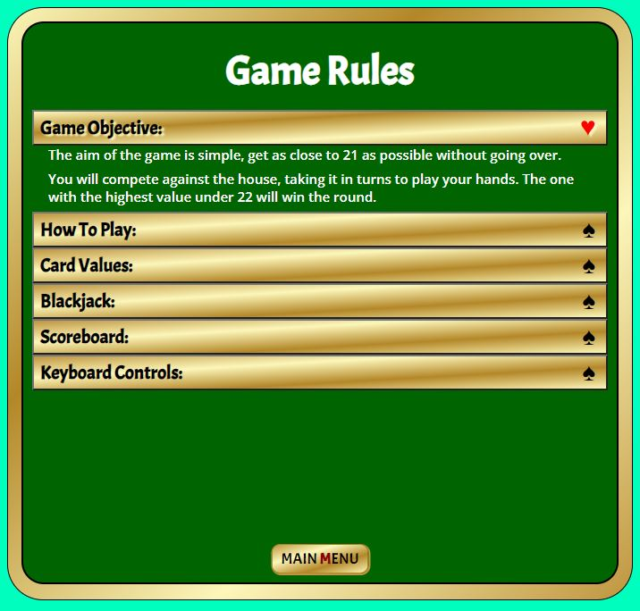
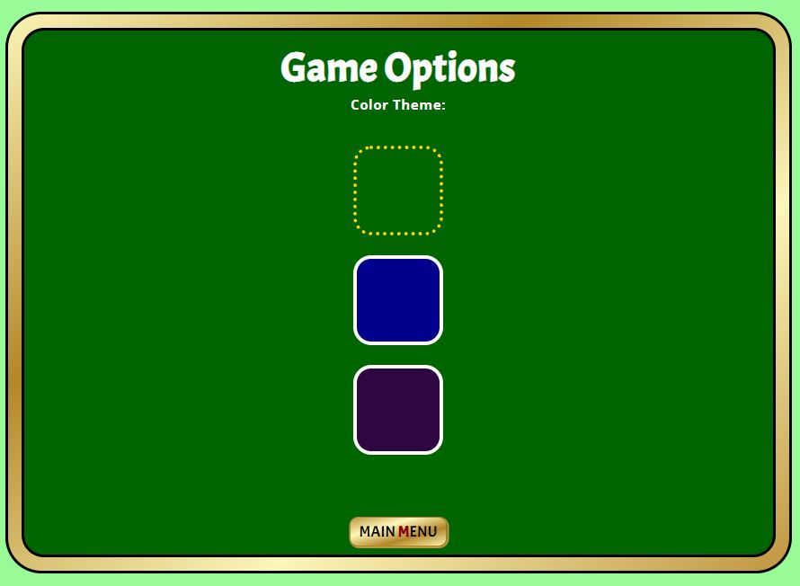
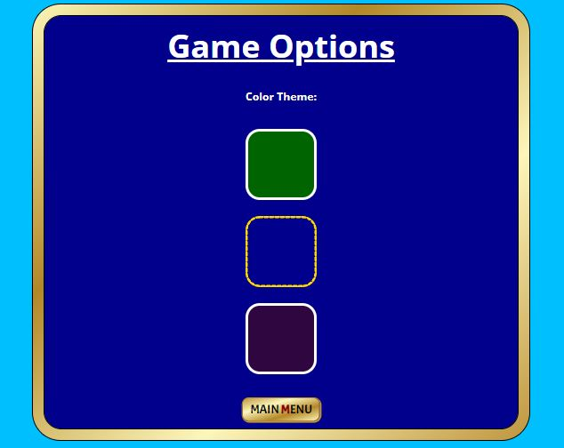
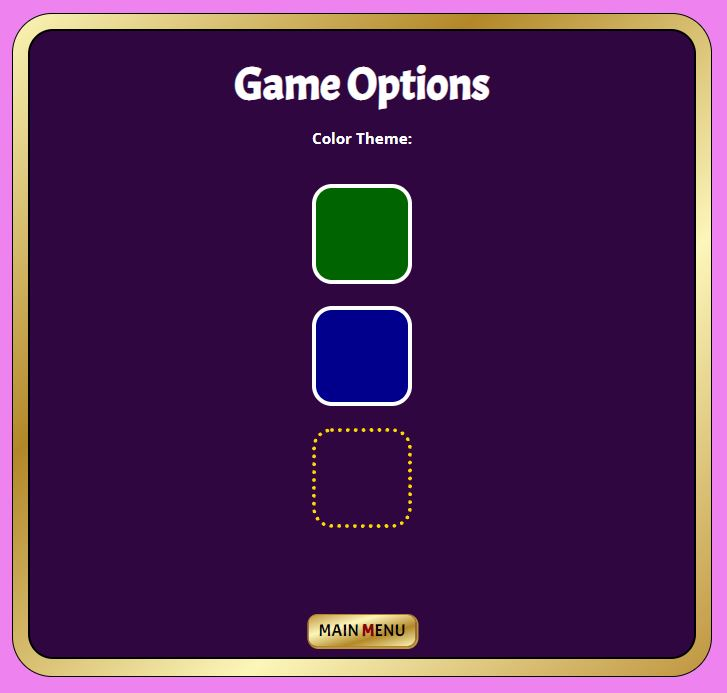
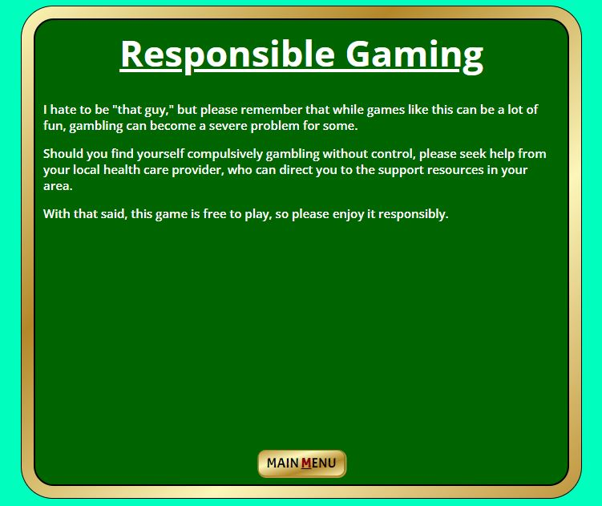

/*check why wireframes are not showing as link to images*/

# **Blackjack**
## **Site Overview**
Blackjack is a classic game dating back to around the 1700s. This game is enjoyed in many forms, from casinos worldwide to kids on the school bus looking to pass the time with a simple game of cards.

My current line of work is in the online casino industry. Hence, I wanted to create something relevant to my daily life. I intend this game to be a bit of harmless fun, to be used to pass the time, much like those days spent on the back of the bus playing for pennies.

## **Planning Stage**

### **Target Audience:**
* Adults who enjoy playing blackjack for the strategy but do not want to spend money playing.
* Fans of the classic card game blackjack.
* People are looking for an enjoyable way to spend some time away from a more concentrated task.
* Visually impaired people who still want to join in the fun of playing blackjack for free online.

### **User Stories:**
As a user, I want to: -
* Be able to play blackjack for free without the need to break the bank if I lose.
* Be able to navigate around the game controls and menu with as few clicks as possible.
* Use keyboard shortcuts instead of the mouse.
* Track the progress of each round in some way.
* Find a clear explanation of the game rules and how to play.
* Be able to toggle the sound on and off.
* Adjust the color settings of the game table and surrounding area.

### **Site Aims:**
1. To provide a free version of blackjack that anyone can enjoy.

1. Be fully accessible to the visually impaired.

1. Ensure the site is easy to navigate.

1. Provide simple to understand instructions.

1. To enable the user to use the keyboard as much as possible should they choose to.

1. Provide a record of all wins, loses, and draws.

1. Provide feedback to the user after each round.

1. To be an enjoyable distraction to fill the user's time.
   
### **How Will This Be Achieved:**
1. The game will be free to use, and no sign up required.

1. Ensuring the use of semantic elements, alternate text, and aria labels where appropriate.

1. The landing page will be the main menu. Access to the main menu can also be done throughout the game using the menu button or pressing m on the keyboard. This menu will contain links to:
        * Game rules.
        * Game options menu. 
        * Card table.
        * Responsible Gaming Statement.

1. The relevant game rules are divided into clearly marked sections of the rules sub-menu. 

1. By indicating keyboard shortcuts on each control button.
 
1. After each round, the relevant tally will be increased by one.

1. Upon the conclusion of each round, a modal will appear on the screen with the result.

1. Providing a simple, appealing, and accessible interface.
   
### **Wireframes:**

To give my project structure and work out the best-intended flow of information, I created the below wireframes as a guide.
    
*Mobile Wireframes:
 * [Game Table and Main Menu.](docs\wireframes\mobile-gameboard-menu.png)

*Desktop Wireframes:
 * [Desktop Game Table](docs\wireframes\desktop-gameboard.png)
 * [Desktop Main Menu](docs\wireframes\desktop-menu.png)

Along the way, the design and menu options have changed slightly to improve the app's user experience. The changes included: -

* User controls and scoreboard switched positions to make the game control more accessible for the user.
* The removal of the contact form option in the menu. This feature was not necessary since I decided to add the social links in the footer.
* All game elements moved within the app's central area. The only exceptions to the were: 
    * Social media links to GitHub and linked in.
    * The title and surrounding images.
    * Menu button visible from the game table but hidden when within the menu itself.

Since this for this project, wireframes are not required and were used only to structure my creative process, I did not feel the need to pre-design each of the sub-menus in turn. For this reason, I have omitted them. 

### **Color Scheme:**
When deciding the app's color scheme, I first began with the classic green table then worked outwards from there. I wanted the app to feel regal like a casino while keeping my contrast scores as high as possible for accessibility purposes.
 
I have created the below color grid using [https://contrast-grid.eightshapes.com](https://contrast-grid.eightshapes.com/?version=1.1.0&background-colors=&foreground-colors=%23FFF%0D%0A%23000%0D%0A%23BF953F%0D%0A%23FCF6BA%0D%0A%23B38728%0D%0A%23FBF5B7%0D%0A%23D3D3D3%0D%0A%238B0000%0D%0A%23FF0000%0D%0A%23FFD700%0D%0A%2300008B%0D%0A%234682B4%0D%0A%2300BFFF%0D%0A%23312B50%0D%0A%23EE82EE%0D%0A%23300640%0D%0A%23008080%0D%0A%2300FFBF%0D%0A%23006400%0D%0A&es-color-form__tile-size=compact&es-color-form__show-contrast=aaa&es-color-form__show-contrast=aa&es-color-form__show-contrast=aa18&es-color-form__show-contrast=dnp)

# **Retake screenshot and delete the heading**

## **Current Features**
###  ***Header Element***
The header element contains the following: -

### ***Title:***

* The title servers to make it clear to the user from the first instance what the game will be. Since the app is all one page and the menu is easily accessible through out gameplay I felt there was no need to include a navigation anchor in the title on this project.

### ***Main Menu button (navigation tag):***
* This navigation button toggles between hidding and visible. 
* When the main menu is already visible the button is set to display none. 
* When the card table is visible it allows the user to navigate back to the menu.
* 

## **Main Window:**
### ***Main Menu (navigation tag):***
* Acts as a landing page for the user. Allowing them: -
  * To proceed directly to the card table.
  * Quick access to the game rules.
  * Access to the options menu.
  * Providing them the industry requirement of a responsible gaming statement.
  

### **Sub Menus**
### ***Game Rules***
On this sub menu I decide to use an accordion menu to seperate and display the different game rules. The reasons and fatures of this are as follows: -
  * Prevents the user getting lost in large reems of text. 
  * With only one section being open at a time this made sure that on smaller screen sizes the game rules did not spill over the edge of the main-window.
  * The accodion buttons show spades pointing up when closed and hearts pointing down when open.
  * Fully accessible with the relevant Aria tags and role assigned and toggled as the user interacts with the relevant sections.

### ***Options:***
On this sub menu the player is able to change the color theme to one of three choices for: -
#### **Green (default) Theme**

#### **Blue Theme**

#### **Purple Theme**

 * Each Theme has a complimentary surround color for the body.
 * All three div's have Aria labels to make them accessible to the visually impaired.
 * Active class toggled with the JS file to ensure only the active theme shows as active in the following ways: -
   * Each div has a white border to make it stand out when not active.
   * The active theme and hover have a dotted yellow border to make it clear which theme has the active class. 

### ***Responsible Gaming:***
Working In the industry I reconsie the importance of this statement on any gmabling related game. Although there is no money involved in my version of the game at present the thrill of the chase can still be present. In fact one feedback from every tester who tried it for me was how addictive the game was. I included this as a warning to those who may feel they have a problem to seek help.

### ***Back to Main menu Button (navigation tag)***
Each sub menu Has a "Main Menu" button at the bottom of the page to navigate back to the root menu.

   

  

## **Future-Enhancements**
* game sound
* Card animation
* Neon color theme
* use for loop to create an array of objects and create an algorythm to shuffle the hand every turn.
* shuffle and create a deck as array of objects.
* Give player the choice over ace high or low.
* Fun money the ability to wager and chosen stake amount.

## **Testing Phase**

***
## **Deployment**
I deployed the page on GitHub pages via the following procedure: -

1. From the project's [repository](https://github.com/dnlbowers/modern-buddhism), go to the **Settings** tab.
1. From the left-hand menu, select the **Pages** tab.
1. Under the **Source** section, select the **Main** branch from the drop-down menu and click **Save**.
1. A message will be displayed to indicate a successful deployment to GitHub pages and provide the live link.

You  can find the live site via the following URL - [Live Blackjack game](https://dnlbowers.github.io/blackjack)
***

## **Credits**
### **Honorable mentions**

The project broke me many times over. Without the support following people I would have made it through. The below are in no specific order.

* [Richard Wells](https://github.com/D0nni387) - Code Institute Mentor who gave me faith in myself throughout and calmed me down in moments of panic. He saw I was struggling and took the time to help me work through the logic.

* [Mark Cutajar](https://github.com/markcutajar) Mark - Helped me calm down enough to plan my basic flow. Mark is a man who has repeatedly helped me and my family in more ways than I could ever decribe and I am proud to have him as a brother in law. 
  

* Mr_Bim_alumni (No github provided) - Explained event listeners to me in a context I understood and gave me hope when it was lost. He was also constantly willing to lend an ear and help me beat out any issue I had without taking over. This mans teaching style is skillful and caring! I could not have managed to get through this project without him seeing my distress and making sure to keep an eye on me from there on. He even pressured me into avoiding my avoidance and I am so glad he did.

* [Simen Daehlin](https://github.com/Eventyret) - Was on my first call with BIM and also aided the tutorial on event listeners. Simen has repeatedly stepped in to guide me along the way and I am lucky to have such a skilled alumini on my side. 

* [Matt Bodden](https://github.com/MattBCoding) - A true friend and confidant. Matt is always close to the keyboard if I need him. His webinar of CSS positioning gave me the aha moment I needed when trying to work out how to fan the playing cards. Since I first met Matt in a random slack call I lnew he was someone I would be able to relate too easily. This man is turely one to watch in the realm of coding. 
  
* [Daisy Mc Girr](https://github.com/Daisy-McG) - Within seconds of me posting the question about the W3C assesability guidelines for accordion menus she jump into a call with me and helped me rubber duck it out. She is truely a super women with a keyboard and I am luck to have had her be to willing to assist me. 

* [Niki Tester](https://github.com/Niki-Tester) - Nik was a shock to me, I posted a radnom question on a problem which had me stumped. I went to bed and in the morning I woke up to a notification and nik's solution. This was Nik's first day of the course and he spent over and hour debugging my code whilst I slept. This man is one to watch going forward.