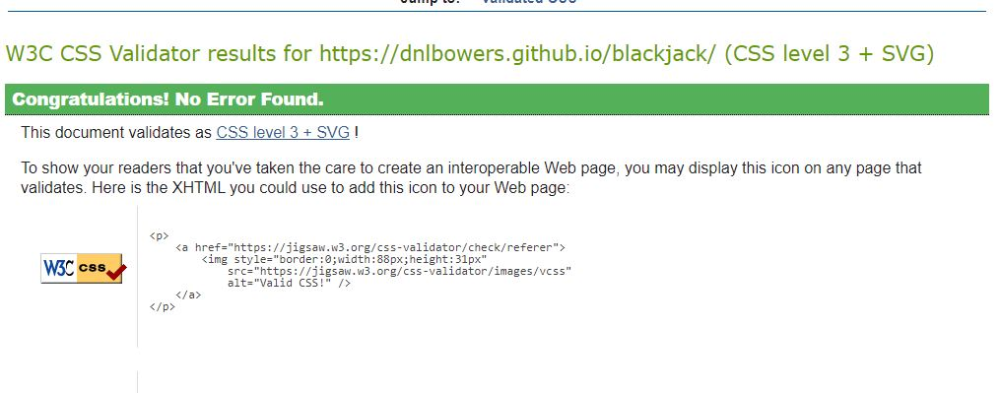
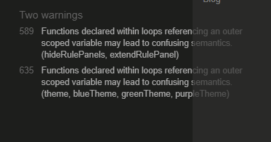
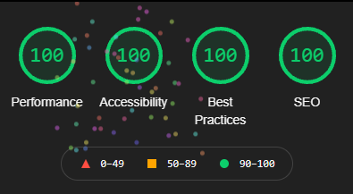
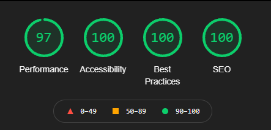

# Table of Contents

* [**During Development Testing:**](#during-development-testing)
  * [***Manual Testing:***](#manual-testing)
  * [***Bugs and Fixes:***](#bugs-and-fixes)
* [**Post Development Testing**](#post-development-testing)
  * [**Validators**](#validators)
    * [***HTML*** - https://validator.w3.org/nu/](#html---httpsvalidatorw3orgnu)
    * [***CSS*** - https://jigsaw.w3.org/css-validator/](#css---httpsjigsaww3orgcss-validator)
    * [***JSHint*** - https://jshint.com/](#jshint---httpsjshintcom)
  * [**Lighthouse Scores**](#lighthouse-scores)
    * [**Test conditions**](#test-conditions)
    * [***Desktop Version:***](#desktop-version)
    * [***Mobile Version:***](#mobile-version)
  * [**Accessability**](#accessability)

## **During Development Testing**
During the development process, I was manually testing in the following ways:-

1. Manually testing each element for appearance and responsiveness via a simulated live server using an extension in VSCode.
    
1. Published the page via GitHub pages and shared with fellow students to test and provide feedback. 

1. Created a post on linked in and asked my network of over 500 developers to review the site and report any issues. The post was viewed more than 900 times and no issues were reported back in the comments.

### ***Manual Testing:***
* During testing, I used four different browsers to ensure cross-compatibility. The desktop browsers used by myself were:

  1. Chrome
  2. Firefox  
  3. Opera
  4. Edge

* I then used the devtools to simulate different screen sizes/devices down to 320 px in width. 
* In addition to this, I also asked several people to test using iPhones and Apple Mac laptops/desktops using safari. These users reported no issues or bugs only style suggestions.
 
### ***Bugs and Fixes:***

1. **Intended Outcome** - A gameplay that looped continuously once initiated and takes the appropriate actions based on the user's input
    * ***Issue Found:***
        * When trying to encase the entire logic in a while loop, I ran into an infinite loop.
        * The loop never paused to listen for the events.
    * ***Causes:***
        * I was trying to use event listeners as something that happened in the flow of the logic. I placed everything in a while loop where the logic required the user's input. My initial thinking was that it would pause the loop until the event was triggered.
        * Due to the above, the while loop was running without any exit condition.
    * ***Solution Found:***
        * Once I understood how the browser loaded event listeners, that once loaded, that they were always there waiting for the event to trigger. I moved the event listeners into the global scope and used them to trigger functions that looped the game logic using clicks and key-down events without needing a while loop. 
        * Shrunk the scope of the while loop to encompass only the computer turn, which required no user input.
1. **Intended Outcome** - Sub menus displayed and hidden within a single HTML container as required (sub-menu methodology for the final product changed see point 9).
    * ***Issue Found:***
        * Initially, I had only one container for sub-menus in the index.html file. I was using javascript to insert all content into this one section using the javascript inner.HTML method. This method worked; however, The exit button did not return the user to the main menu.
    * ***Causes:***
        * The Javascript file was being used to insert the button along with the sub-menu content. The event listeners could not find the button upon loading the page, meaning the sub-menu exit button did not function.
    * ***Solution Found:***
        * By giving the single HTML container a button loading with the DOM, the event listener worked without issue to hide the sub-menu and bring the main menu back into view. Leaving the javascript file to insert the sub-menu content only. 
1. **Intended Outcome** - Divided sections for the Game Rules that fit within the space available for the sub-menu.          
    * ***Issue Found:***
        * While keeping the font large enough to be readable, the text extended past the modals bottom edge on smaller screens.
    * ***Causes:***
        * Larger volume of text on a narrow screen. 
    * ***Solution Found:***
        * To resolve this, I created an accordion menu. At first, although this looked pretty, the issue remained if more than one section was open at a time. After some research, I found that creating a function to close all sections when the user clicks a new one could prevent this issue completely. The result was an accordion menu that would only open the clicked section, closing the rest before opening, allowing all the rules to fit in a small space.
1. **Intended Outcome** - Small, frequent, and descriptive commits, ensuring I  used proper version control.         
    * ***Issue Found:***
        * This one was less of a bug, but something to be noted is the two very large commits {895c74e} and {d8bcc80}. There may have been more, but these are the two I caught with committing.
    * ***Causes:***
        * Due to using SVG files for all card images, each one was read as multiple lines of code. The above two commits were from adding selection card back images and removing the unused ones. One huge SVG file of the Linux penguin appears to account for the bulk of the additions/deletions in these commits.
    * ***Solution Found:***
        * Since this was not a bug, no fix is needed.
1. **Intended Outcome** - Cards fanned out on the table in a staggered fashion, so only the left side of the card was visible under the card on top.        
    * ***Issue Found:***
        1. The function fanCards() would work for the first two cards dealt, but when re-dealing the first two cards, they would appear to the right as if the original cards were still on the table.
        1. The second issue I then faced was for the house hand. It would place the first two cards correctly but then place the third visible card an extra 15px (total of 30px) to the right of the last one.
    * ***Causes:***
        1. Looking in dev tools, I could see that the positioning calculation was continuing from where the last hand left off. The solution was guesswork, but it seemed like a logical move, even though I didn't fully understand why it worked.
        1. This was largely caused but the first house card that was dealt and then hidden immediately. 
    * ***Solution Found:***
        1. I originally had the content of resetHand() as the last step in the game loop. By making it the first function in firstTwoCards(), which resolved all issues for the player hand positioning 
        1. This was a 3 part solution:-   
            * Adding a parameter to the function (fanCard()) and using a conditional statement to position the cards according to the hand passed to the function. When detecting the house hand, the function adjusted the algorithm to account for the hidden card. This step moved the jump in positioning further toward the left of the hand.   
            * Using an if statement to hide the first house card dealt and replaced it with the back of a card. 
            * Changing the order in which the game made the reveal. First, I needed to hide the card back, position the card to be revealed, and make the hidden card visible by setting it to inline.
1. **Intended Outcome** - A responsive layout suited to all screen sizes.        
    * ***Issue Found:***
        * Due to trying to keep both height and width of the whole page on the screen no matter height or width, the layout was becoming disorganized and squashed together.
    * ***Causes:***
        * Trying to win the battle of matching all screen heights as well as widths.
    * ***Solution Found:***
        * Instead of making the page 100vh, so everything matched the screen height, I gave the main surround a set height. The game was still playable on an iPhone 5s/SE, which is 568px high. The height then increases slightly for the min-width 360px media query to allow a bit more space to work with on larger screen widths.
1. **Intended Outcome** - A running total displayed on the player side, reflecting the increase in hand value with each card drawn by the user.       
    * ***Issue Found:***
        1. When the player total went over 21, the running total showed the value "undefined."
        1. The running total would not update when the system converted an Ace from high to low, so the user would see a  total over 21 due to Ace being equal to eleven, even though the computer saw the Ace as having a value of one. The change in Ace value would only reflect once the player drew the next card. 
    * ***Causes:***
        1. Where the player bust check was in check hand value, there was no value returned.
        1. There was no check hand value after the Ace high to low conversion.
    * ***Solution Found:***
        1. Adding a return statement to the player bust check, the running total was updating accurately even when the player went over 21.
        1. By adding a checkHandValue() to the hit me button, the running total updated correctly, reflecting the Ace high to low feature where appropriate accurately.
1. **Intended Outcome** - Losses tally updates by one every time the player loses.        
    * ***Issue Found:***
        * Every time the player went bust, the losses would increase by 2.
    * ***Causes:***
        * This was a side effect of solution 7b above. Calling the function twice when a player went over 21.
    * ***Solution Found:***
        * By refactoring the Ace conversion code, I made the for loop look for the first Ace in the hand with a value higher than 21. Upon finding an Ace, the code would convert the value from high to low and use a return statement to terminate the loop. Negating the need for the additional function call in the click and key down event. 
1. **Intended Outcome** - Large chunks of HTML rendered in the HTML file upon loading and visibility toggled with CSS rather than inserted with the JS file using event listeners.       
    * ***Issue Found:***
        * After moving all sub-menus to the HTML file, the rules menu started with an interesting issue. The accordion menu would only work every other time I accessed the rule menu.
    * ***Causes:***
        * The users clicking to access the rules added the event listeners responsible for the accordion functionality repeatedly.   
    * ***Solution Found:***
        * Moving the ruleMenuFunctionality() function call to the global scope rather than calling it from the event listener. This way, the event listener was only added once at the start of the game and remained active whenever required rather than a new event listener added every time the user accessed the rule menu.
1. **Intended Outcome** - Three separate color themes that the user could toggle between, the active class would change to highlight the active theme.      
    * ***Issue Found:***
        * The for loop was working to change only the options menu. The game area and the other menus remained the default color.
    * ***Causes:***
        * Originally, I was using querySelector in the constant reference.  
    * ***Solution Found:***
        * Using querySelectorAll and using a second for loop to cycle through the resultant array of elements with the class of "main-window.". For Each object of the array, I then change the elements' color to the chosen theme using mainWindowRef[i].style.backgroundColor.     
1. **Intended Outcome** - Key events that worked even if caps lock was on.      
    * ***Issue Found:***
        * My key events worked, but while testing, I noticed that when the caps lock was on, the key event didn't trigger
    * ***Causes:***
        * The key event was set to fire only on the lower case letter.  
    * ***Solution Found:***
        * At first, I Just added an or statement to check for the event.key === "lowercase" || event.key === "uppercase". I later simplified the code to event. key.toLowerCase() === "lowercase", this converted any uppercase to lower case and accepted all lowercase letters.
1. **Intended Outcome** - Automated computer turn plays when under a hand value of 17 and stops once the hand value exceeds 17.      
    * ***Issue Found:***
        * The computer would still draw a card after exceeding the handValue of 17.
    * ***Causes:***
        * Whilst refactoring the computerTurn() function I removed the check for dealerTotal >= 17. 
    * ***Solution Found:***
        * Re-added a conditional check that when the dealer total exceeds 17 the compareHands() function is called with a return statement.

## **Post Development Testing**
### **Validators**

#### ***HTML*** - [https://validator.w3.org/nu/](https://validator.w3.org/nu/?doc=https%3A%2F%2Fdnlbowers.github.io%2Fblackjack%2F)

Returned no errors when checking the HTML document.

#### ***CSS*** - [https://jigsaw.w3.org/css-validator/](https://jigsaw.w3.org/css-validator/validator?uri=https%3A%2F%2Fdnlbowers.github.io%2Fblackjack%2F&profile=css3svg&usermedium=all&warning=1&vextwarning=&lang=en)

All pages tested, no issues found via URL or file upload.  
  

#### ***JSHint*** - [https://jshint.com/](https://jshint.com/)

Besides the occasional missing semicolon, the only thing shown by JsHint was the below two warnings: -

Some research into this error revealed just a cautionary warning and not an error and the use of forEach resolved this warning. The final metrics returned by JSHint were:

* There are 48 functions in this file.

* Function with the largest signature take 3 arguments, while the median is 0.

* Largest function has 44 statements in it, while the median is 5.

* The most complex function has a cyclomatic complexity value of 16 while the median is 1.

### **Lighthouse Scores**
#### **Test conditions**
* I did all lighthouse tests in incognito mode to avoid interference from browser extensions. 
* I ran the tests for both mobile and desktop. 

#### ***Desktop Version:***

#### ***Mobile Version:***

### **Accessability**

In addition to the lighthouse accessibility score, I also used [WAVE - Web accessibility evaluation tool](https://wave.webaim.org/report#/https://dnlbowers.github.io/blackjack/) to check my pages for accessibility, and the site returned no errors.

***

[return to README.md](README.md)